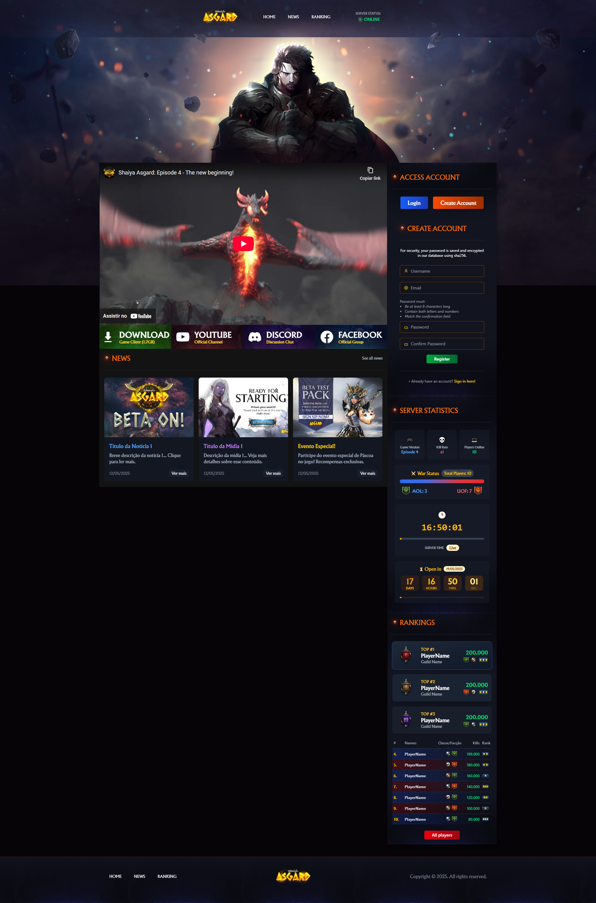

# Shaiya Asgard - WebSite - 2025




> Este é o projeto de um website moderno para o jogo Shaiya Asgard, desenvolvido com Django. Ele oferece autenticação de usuários, um novo design de interface (UI/UX) e um sistema de ranking dinâmico integrado a um banco de dados relacional.

### Ajustes e melhorias

O projeto ainda está em desenvolvimento e as próximas atualizações serão voltadas para as seguintes tarefas:

- [x] Implementação de autenticação de usuários (registro e login).
- [x] Desenvolvimento de novo design UI/UX para o website.
- [x] Adição de tabela de rankeamento vinculada ao banco de dados.
- [ ] Criação de painel de controle para o usuário.
- [ ] Otimização de performance e segurança.
- [ ] Adição de funcionalidades de notícias e eventos.

## 💻 Pré-requisitos

Antes de começar, verifique se você atendeu aos seguintes requisitos:

- Você instalou a versão mais recente do **Python 3.10+** (necessário para `Django 5.1.6`).
- Você tem o **pip** instalado e atualizado.
- Você tem o **Node.js e npm** instalados (necessários para compilar o Tailwind CSS).
- Você tem o **SQL Server** instalado ou acesso a uma instância de SQL Server para o banco de dados.
- **Driver ODBC para SQL Server:** Para a conexão com o MSSQL, é crucial que você tenha o driver ODBC correspondente instalado em seu sistema (ex: `ODBC Driver 17 for SQL Server`).
- Você tem uma máquina **Windows** para o setup de produção (`Windows Server` e `Nginx`). O ambiente de desenvolvimento é compatível com Windows, Linux e macOS.
- Você leu as seções de instalação e configuração abaixo.

## Instalando Shaiya Asgard Website

Para instalar e configurar o Shaiya Asgard Website, siga estas etapas:

### 1. Clone o repositório:

```bash
git clone https://github.com/matheusvalpassos/Shaiya-Django-Website.git 
cd Shaiya-Django-Website
```
### 2. Crie e ative o ambiente virtual:

Linux e macOS:
```
python3 -m venv .venv
source .venv/bin/activate
```

Windows:
```
python -m venv .venv
.venv\Scripts\activate
```

### 3. Instale as dependências Python:

Todas as dependências listadas no requirements.txt serão instaladas.
```
pip install -r requirements.txt
```

### 4. Instale as dependências Node.js (para Tailwind CSS):
```
npm install
```

### 5. Configure a conexão com o banco de dados (MSSQL):

Edite o arquivo myproject/settings.py (ou onde suas configurações de DB estão, como config/settings.py) e configure a seção DATABASES para apontar para o seu SQL Server. Exemplo:

# myproject/settings.py (ou config/settings.py)
```
DATABASES = {
    'default': {
        'ENGINE': 'mssql', # Ou 'sql_server.pyodbc' dependendo da sua configuração
        'NAME': 'SUA_BASE_DE_DADOS',
        'HOST': 'SEU_SERVIDOR_SQL',
        'PORT': '', # Deixe vazio para a porta padrão (1433)
        'USER': 'SEU_USUARIO_DB',
        'PASSWORD': 'SUA_SENHA_DB',
        'OPTIONS': {
            'driver': 'ODBC Driver 17 for SQL Server', # Verifique o driver ODBC correto instalado
            'autocommit': True, # Opcional: para commits automáticos após cada operação
        },
    }
}
```
⚠️ Certifique-se de ter o driver ODBC instalado corretamente no sistema! 

### 6. Execute as migrações do banco de dados:

```python manage.py migrate```

### 7. Compile o Tailwind CSS:

```npm run build-tailwind``` 

# Ou o comando que você configurou para compilar o CSS

(Se você configurou npx tailwindcss -i ./src/input.css -o ./static/css/main.css --watch no package.json, pode ser npm run watch-tailwind para desenvolvimento ou npm run build-tailwind para produção).

## ☕ Usando o Shaiya Asgard Website

Inicie o servidor de desenvolvimento:

```
python manage.py runserver
```

Acesse: http://127.0.0.1:8000/ no navegador.

### Funcionalidades Disponíveis:

**Página Inicial**: Apresentação do projeto com elementos visuais interativos.
**Autenticação** : Registre ou faça login com formulários dinâmicos.
**Ranking** : Visualize a tabela de classificação integrada ao banco de dados.

## 📫 Contribuindo para o Projeto

Para contribuir com o Shaiya Asgard Website, siga as etapas descritas no guia de contribuição:

1. Bifurque este repositório.
2. Crie um branch: `git checkout -b <nome_branch>`.
3. Faça suas alterações e confirme-as: `git commit -m '<mensagem_commit>'`
4. Envie para o branch original: `git push origin <nome_do_projeto> / <local>`
5. Crie a solicitação de pull.

Como alternativa, consulte a documentação do GitHub em [Guia de Contribuição (CONTRIBUTING.md)](https://help.github.com/en/github/collaborating-with-issues-and-pull-requests/creating-a-pull-request).

## 🤝 Colaboradores

Agradecemos às seguintes pessoas que ajudaram neste projeto:

<table>
<tr>
<td align="center">
<a href="https://github.com/matheusvalpassos" title="Matheus Valpassos">
<br>
<sub><b>Matheus Valpassos</b></sub>
</a>
</td>
</tr>
</table>

## 😄 Seja um dos contribuidores

Quer fazer parte desse projeto? Clique [AQUI](CONTRIBUTING.md) e leia como contribuir.

## 📝 Licença

Esse projeto está sob licença. Veja o arquivo [LICENÇA](LICENSE.md) para mais detalhes.